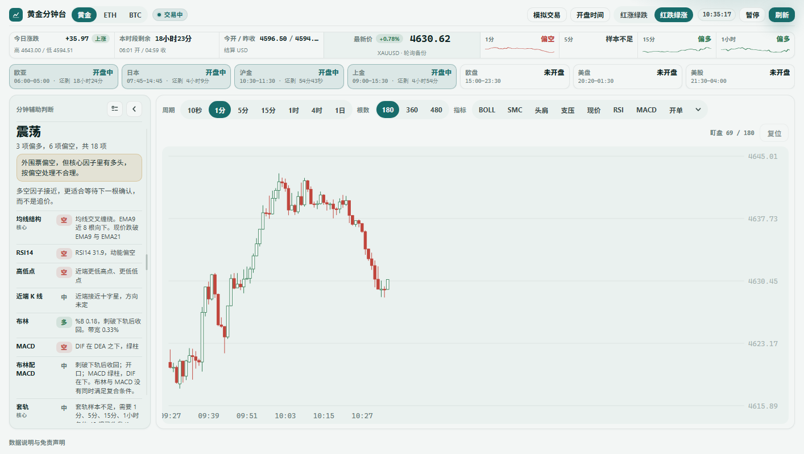
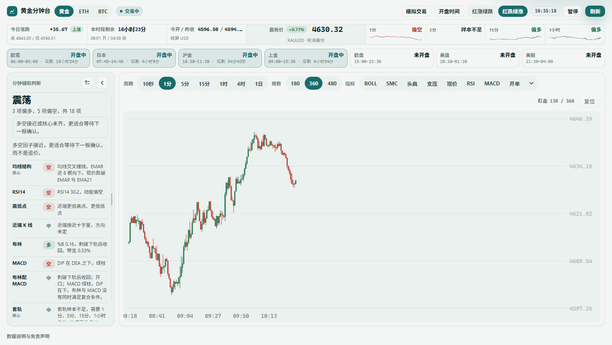
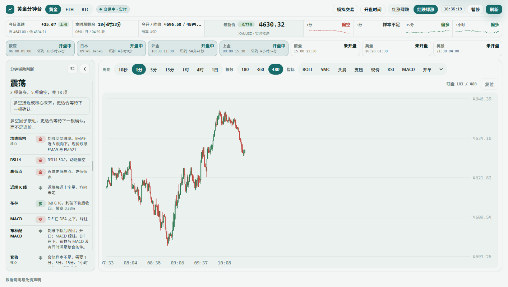
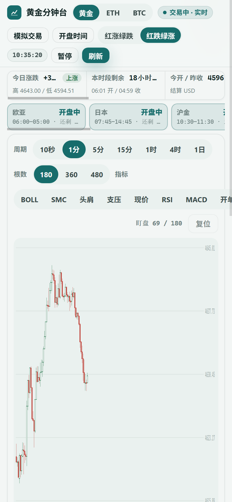
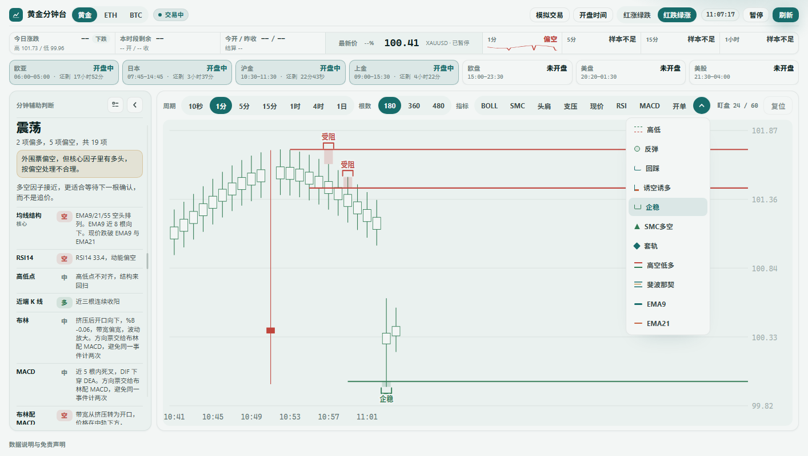
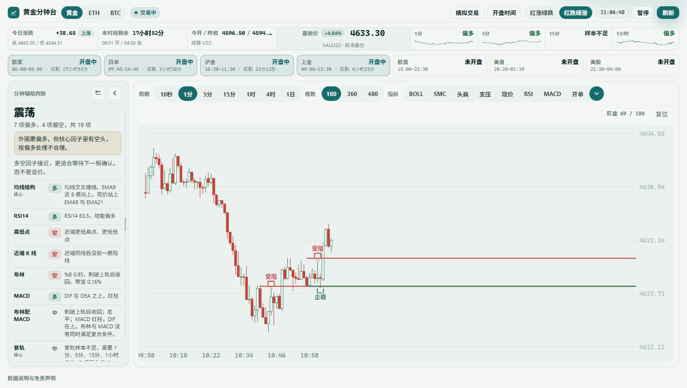
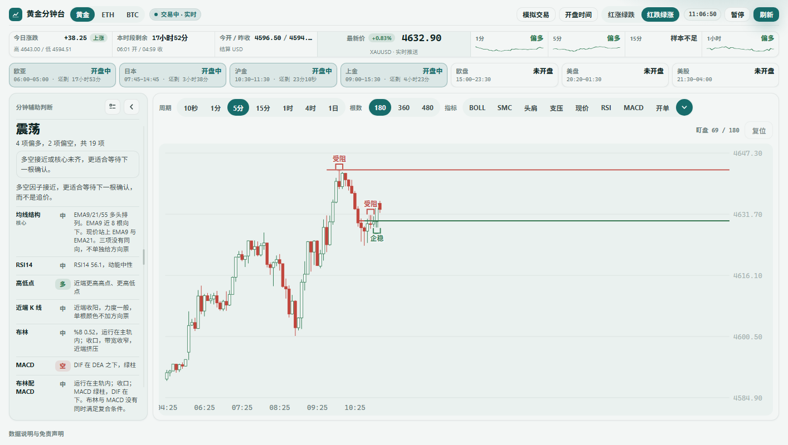
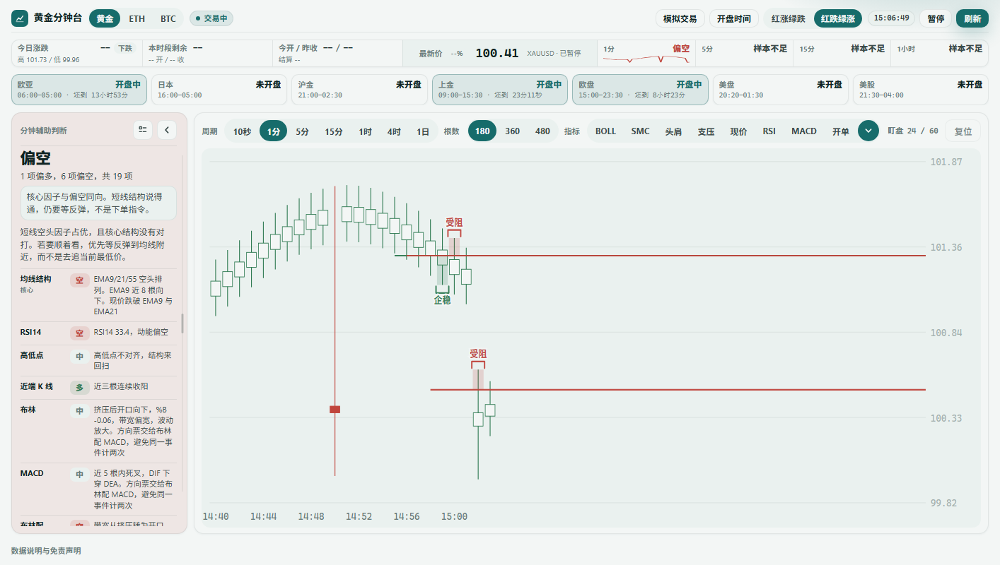
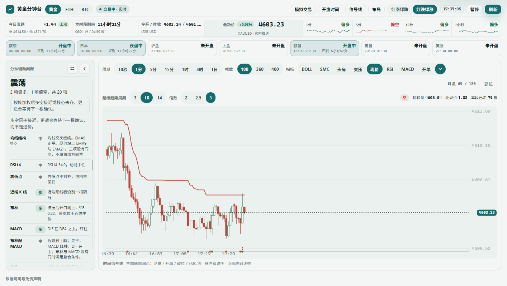
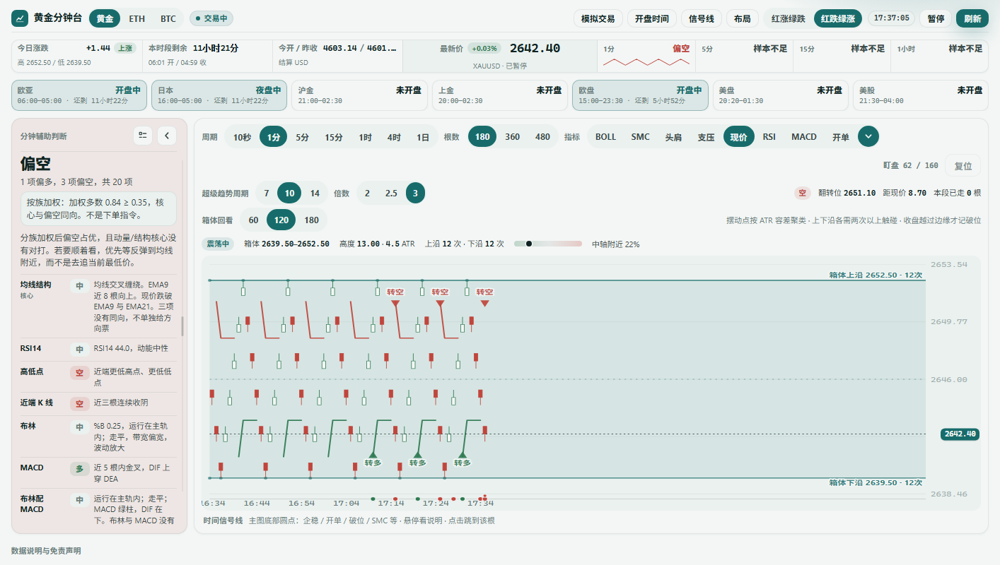

# 分钟台 · XAUUSD

本地盯盘页，读取 Gate.io 公共行情，用来对照黄金 CFD、ETH 永续和 BTC 永续的价格结构。

页面会给出均线、布林、多周期和形态对照，也会给出纸面开单信号与模拟成交记录。这些内容只描述结构，不是下单指令，也不构成投资建议。本仓库不会向交易所发单。

仓库地址：<https://github.com/stysams/xau-indicator>

## 最新更新

### 2026-08-31

波段与支撑压力口径按主流枢轴、ZigZag、Dow Theory 和价格区域方法统一：新增显著反转过滤，区分已确认端点与进行中端点；撑压改为按完整区域确认触碰和破位，并支持连续角色互换。详见[波段高低与支撑压力口径调研](docs/swing-support-resistance-standard.md)。

支压指标增加“支压类型”配置，可在常规、波段、撑压之间三选一：常规显示结构化支撑压力，波段显示趋势段高低，撑压只显示当前价格附近的最近支撑与压力。配置会保存在本机。详见[发布说明](docs/releases/release-notes.md)。



## 快速开始

需要本机已安装 [Node.js](https://nodejs.org/)（建议 18 或更高）。没有额外依赖，不必执行 `npm install`。

在仓库根目录启动本地服务：

```bash
node serve.js
```

浏览器打开 <http://127.0.0.1:8787>。

服务只监听 `127.0.0.1:8787`。默认首页是 `gold-minute.html`。不要用 `file://` 直接打开页面：浏览器没有 CORS，无法直连 Gate.io REST。

可用环境变量改端口：

```bash
set PORT=8787
node serve.js
```

## 仓库里有什么

| 路径 | 作用 |
| --- | --- |
| `gold-minute.html` | 页面骨架：DOM 结构，引用 `src/style.css` 与 `src/main.js` |
| `src/` | 页面源码，按层拆开的原生 ES 模块，无构建步骤 |
| `serve.js` | 本地静态服务，并转发 TradFi / 永续 REST 与 WebSocket |
| `server.js` | Gate.io CFD 公共行情 MCP，走标准输入输出，给其它工具查询用 |
| `tests/` | 指标数学、随机漫步基准、样本外种子对照与基线回归；根目录执行 `node tests/run-all.mjs` |
| `docs/optimization-backlog.md` | 2026-08-27 审查清单与落地状态 |
| `memory/*.png` | README 引用的界面截图。日记 Markdown 与临时校验脚本不入库 |

页面行情不经过 `server.js`。MCP 是另一条查询通道。

### 源码结构

`src/` 分层组织，依赖自上而下：

| 目录 | 职责 | 能否脱离浏览器运行 |
| --- | --- | --- |
| `src/state.js` | 全局状态、品种定义、尺寸常量 | 能 |
| `src/core/` | 数学指标、格式化、K 线时间、交易时段 | 能 |
| `src/indicators/` | BOLL、SMC、头肩、支压、斐波那契、企稳、回踩、诱空诱多、高空低多、套轨、超级趋势、箱体震荡 | 能 |
| `src/judge/` | 因子分族、各因子投票、`judge` 聚合 | 能 |
| `src/trade/` | 快单信号、纸面成交、模拟订单 | 否（牵连渲染） |
| `src/net/` `src/view/` `src/ui/` | REST/WS、绘图、交互绑定 | 否 |
| `src/main.js` | 事件绑定与启动序列，挂 `window.__goldTest` | 否 |

前四层可以直接 `import` 进 Node 做单元测试，`tests/` 就是这么用的。`trade/` 及以下会间接引入 DOM，只能经浏览器测。

`src/view/` 与 `src/trade/` 之间存在循环引用——业务逻辑直接调渲染函数是原有设计，拆分时按原样保留。ES 模块对函数声明的循环引用是安全的。

### 改动源码后怎么验证

```bash
node tests/run-all.mjs                  # 数学口径 + 噪声基准 + 样本外对照
WITH_BROWSER=1 node tests/run-all.mjs   # 追加基线回归（需要本机 Chrome）
```

`tests/_baseline/snapshot.json` 锁定了 33 个场景下全部 `compute*` 与 `judge` 的输出。确实要改变行为时，用 `node tests/_baseline/record.mjs` 重录并 review 差异。基线走 `window.__goldTest`，与内部结构无关，重构时不必改动。Chrome 路径可用 `CHROME_PATH` 覆盖。

## 分钟台能做什么

### 品种

- 黄金：Gate.io CFD / TradFi，代码 `XAUUSD`
- ETH：Gate.io USDT 永续，代码 `ETH_USDT`
- BTC：Gate.io USDT 永续，代码 `BTC_USDT`

### 主图

- 周期：10 秒、1 分、5 分、15 分、1 小时、4 小时、1 日
- 根数：180、360、480，默认 180
- 滚轮对准鼠标位置缩放，拖动平移，双击或「复位」回到盯盘视窗
- 盯盘时最新一根默认放在画面中间偏左，右侧留空，可贴右沿跟随实时最后一根
- 时间信号线：主图底部色点汇总近期触发事件；「信号线」按钮可开关
- 布局预设：顶栏「布局」一键切换盯盘界面密度与常用指标组合

第一次打开时，主图指标默认全部关闭。本机已经记住过开关的，仍按上次。

### 指标

主条固定 8 项：BOLL、SMC、头肩、支压、现价、RSI、MACD、开单。其余收进右侧下拉。

| 指标 | 做什么 |
| --- | --- |
| BOLL | 默认 20 周期、2 倍标准差。可叠加 1σ / 主轨 / 3σ，可改周期、倍数、实线或虚线、线条颜色和背景 |
| SMC | 近端结构突破、订单区块、未回补缺口。做多做空箭头由「SMC多空」单独开关 |
| 头肩 | 摆动点找左肩、头、右肩和颈线。收盘穿过颈线才算完成 |
| 支压 | 确认摆动点按 ATR 容差聚成价格区域，连续接触合并计数；整数位、今开和昨收作为补充，BOLL20 只作动态参照；收盘越过整个区域和缓冲后才确认破位，并支持支撑与压力连续互换 |
| RSI | Wilder 平滑，默认 14，可改 6 或 9。70 / 30 是超买超卖带，超买超卖不加方向票 |
| MACD | 12 / 26 / 9。可与布林组成复合信号，只描述近端结构是否对齐 |
| 开单 | 1 分和 5 分定方向，10 秒回踩或触轨收回后给出开多或开空。正在走的那根只预备，收盘才记纸面仓 |
| DXY 对照 | 左侧因子比较黄金与 USIDX DXY 的近端方向；仅在黄金与 DXY 反向运行时给宏观方向票，同向时标记传统相关性暂时失效，不加票 |
| 日内均价 | 有成交量时按典型价格加权计算 VWAP；黄金没有统一现货成交量时退化为日内典型价格均值。只作日内成本位置参考 |
| ATR | 衡量当前波动；用于超级趋势、结构容差和模拟止损距离，不单独判断方向 |

| 超级趋势 | 在指标下拉。ATR 包络趋势跟踪：多头段线在价格下方，空头段线在价格上方，收盘穿越才换向并标转多 / 转空。周期 7 / 10 / 14，倍数 2 / 2.5 / 3 |
| 箱体震荡 | 在指标下拉。摆动高低点按 ATR 容差聚类成横向箱体，上下沿各需两次以上触碰。画上下沿、中轴与触碰点，收盘越过边缘一定幅度才记上破或下破。回看 60 / 120 / 180 根 |
| 高低 / 反弹 / 回踩 / 诱空诱多 / 企稳 / 套轨 / 高空低多 / 箱体震荡 / 斐波那契 / 超级趋势 / EMA9 / EMA21 | 在指标下拉里单独开关 |

判断栏左侧的因子勾选和主图开关是分开的：可以只画不计入判断，也可以只判断不画。

### 界面截图

截图文件都在仓库的 `memory/` 目录。README 用根目录相对路径引用，GitHub 会直接显示。本机跑起 `serve.js` 后，同一文件对应 `/memory/<文件名>`，例如 <http://127.0.0.1:8787/memory/_bars-180.png>。

| 截图 | 仓库路径 | 本机地址 |
| --- | --- | --- |
| 桌面 180 根 | `memory/_bars-180.png` | `/memory/_bars-180.png` |
| 桌面 360 根 | `memory/_bars-360.png` | `/memory/_bars-360.png` |
| 桌面 480 根 | `memory/_bars-480.png` | `/memory/_bars-480.png` |
| 手机 180 根 | `memory/_bars-mobile.png` | `/memory/_bars-mobile.png` |
| 企稳开关 | `memory/_hold-menu.png` | `/memory/_hold-menu.png` |
| 1 分企稳受阻 | `memory/_hold-live.png` | `/memory/_hold-live.png` |
| 5 分企稳受阻 | `memory/_hold-live-5m.png` | `/memory/_hold-live-5m.png` |
| 合成样本标注 | `memory/_hold-synth.png` | `/memory/_hold-synth.png` |
| 真实行情超级趋势 | `memory/_trend-live-st.png` | `/memory/_trend-live-st.png` |
| 合成箱体 + 超级趋势 | `memory/_trend-box-synth.png` | `/memory/_trend-box-synth.png` |

**根数：180 / 360 / 480**





**手机**



**企稳 / 受阻**

开关在指标下拉。影线探到支撑、均线或前低后收盘守在这一侧标企稳；碰到压力或前高后收盘仍在下方标受阻。正在走的那根只标预备。









**超级趋势 / 箱体震荡**

超级趋势开在指标下拉，设置栏可调周期与倍数，右侧读数给出当前方向、翻转位、距现价距离和本段已走根数。



箱体震荡需要上下沿各有两次以上触碰才画；下图是合成的横向震荡样本，同时开了超级趋势。



### 其它界面

- 红涨绿跌 / 红跌绿涨，写入本机
- 黄金显示各交易所开盘时段（状态条，不弹提醒）
- 模拟交易：多笔订单，按品种分 key 存在本机，按点击时的最新价开平，不向交易所发单
- 快单窗口可拖动，触发后会把开仓价、平仓价和盈亏价差记入模拟订单

## 数据从哪来

全部是 Gate.io 公共接口。

| 品种 | REST | WebSocket |
| --- | --- | --- |
| 黄金 | `/api/v4/tradfi` | `wss://fx-ws.gateio.ws/v4/ws/tradfi` |
| ETH / BTC | `/api/v4/futures/usdt` | `wss://fx-ws.gateio.ws/v4/ws/usdt` |

`serve.js` 把浏览器请求转到这些地址：

- `/api/v4/tradfi/*`、`/api/v4/futures/*` → `api.gateio.ws`
- `/ws/tradfi` → `fx-ws.gateio.ws/v4/ws/tradfi`
- `/ws/futures` → `fx-ws.gateio.ws/v4/ws/usdt`

1 分、5 分、15 分、1 小时、4 小时、1 日的 K 线和报价走实时推送，大约 250 毫秒更新一次，历史根用 REST 补齐。黄金 10 秒线有 REST 历史，但 TradFi 推送通道不更新 10 秒，正在走的那根用报价按 10 秒归桶。永续 10 秒线推送通道会更新。

黄金 K 线没有成交量。永续 K 线有量，主图仍按价格结构画，没有另开量能副图。

页面优先直连 Gate.io WebSocket；连不上时再走本机 `/ws/tradfi` 或 `/ws/futures` 转发。

## MCP 服务器

`server.js` 用标准输入输出提供 Gate.io CFD 公共查询，无需 API 密钥。工具名：

- `gate_cfd_list_categories`：品种类别
- `gate_cfd_list_symbols`：品种列表，可按类别过滤
- `gate_cfd_get_ticker`：单品种实时行情
- `gate_cfd_get_klines`：K 线，周期 `1m` / `5m` / `15m` / `30m` / `1h` / `4h` / `1d`

示例配置（把路径换成你的本机目录）：

```json
{
  "mcpServers": {
    "gate-cfd": {
      "command": "node",
      "args": ["D:/project/ai/xauusd/server.js"]
    }
  }
}
```

MCP 只覆盖 CFD / TradFi。ETH、BTC 永续请用分钟台或 `serve.js` 的 futures 转发。

## 本机记住什么

开关、配色、模拟订单、左侧栏宽度、快单窗口位置等写在浏览器 `localStorage`，键名以 `gold-minute-` 开头，按品种分开存放。清站点数据就会丢掉这些记录。

## 免责声明

这是结构对照工具，不预测涨跌，不构成投资建议，也不会代你下单。点差过大时纸面开单会暂停。更细的口径、节假日和形态规则写在页面底部「数据说明与免责声明」。
